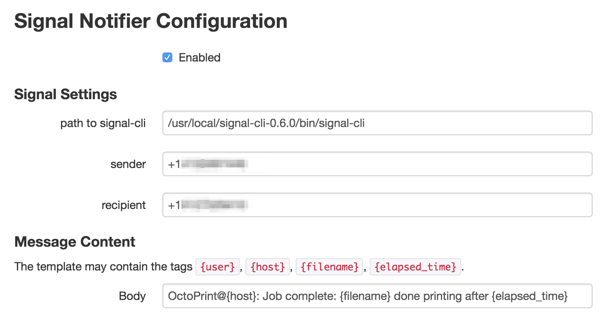

# OctoPrint_Signal-Notifier

Recieve Signal (https://signal.org/) messages when OctoPrint jobs are complete.

Requires signal-cli be installed and configured. See [Prerequisites](README.md#Prerequisites) for more information. 




## Prerequisites

### two phone numbers

You can't send and receive from the same phone number. Google Voice is handy for this.

### signal-cli

signal-cli (https://github.com/AsamK/signal-cli) is required for operation. You'll need to enable strong encryption or ensure you're running a recent version of Java.

Helpful Links:
  - Ubuntu/Raspbian/Octopi installation directions:  https://github.com/AsamK/signal-cli/wiki/HowToUbuntu
  - Ubuntu/Raspbian/Octopi java upgrade directions: https://gist.github.com/ribasco/fff7d30b31807eb02b32bcf35164f11f

Test by running the following as the user Octoprint runs as. 

```
signal-cli -u <sender> send -m "signal-cli works from $USER@$HOST" <recipient>
```

## Installation

Install via the bundled [Plugin Manager](https://github.com/foosel/OctoPrint/wiki/Plugin:-Plugin-Manager)
or manually using this URL:

    https://github.com/aerickson/OctoPrint_Signal-Notifier/archive/master.zip

## Configuration

Configuration is done via the settings panel. You must set a full path to signal-cli (I recommend placing signal-cli in /usr/local/), sender (must be configured in signal-cli), and a recipient. 

Senders and recipients are phone numbers (e.g. +12225554444).

## Acknowledgements

Loosely based on [OctoPrint_FreeMobile-Notifier](https://github.com/Pinaute/OctoPrint_FreeMobile-Notifier).

## License

Licensed under the terms of the [AGPLv3](http://opensource.org/licenses/AGPL-3.0).
